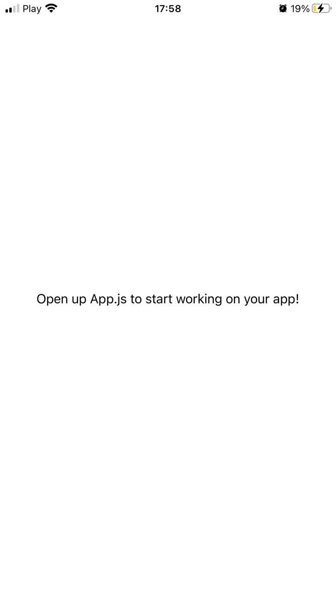
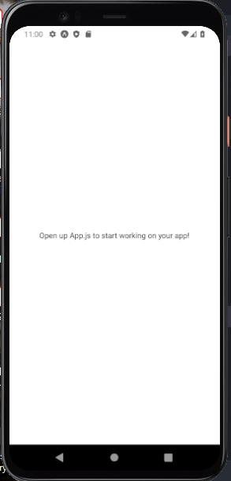

# React Native Project 🚀

## Homework 1

## Initialized a project with Expo and launched it on a mobile device and android emulator using the Expo client and Android Studio.

🍎 https://ibb.co/5WdLypv - Project running on an iPhone
 
📱 https://ibb.co/fXYjxRs - Project running on an Android emulator

  
  

